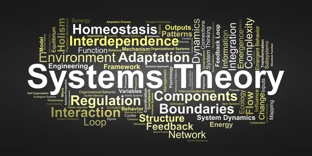

# 🎓 Systems Theory

## 🧠 About the Course

🏫 **Faculty:** Software Engineering & Computer Engineering  
🧑‍💻 **Format:** Offline  

This course focuses on the study of complex systems of various nature.  
It introduces general system principles, classification methods, and approaches to modeling and analyzing dynamic systems.

## 🎯 Goal
Develop systems thinking and the ability to apply systems theory for analysis, design, and management of complex software systems.

## 🧪 Laboratories 

### 1️⃣ [Finite State Machine](lab1/)
### 2️⃣ [Fuzzy System](lab2/)